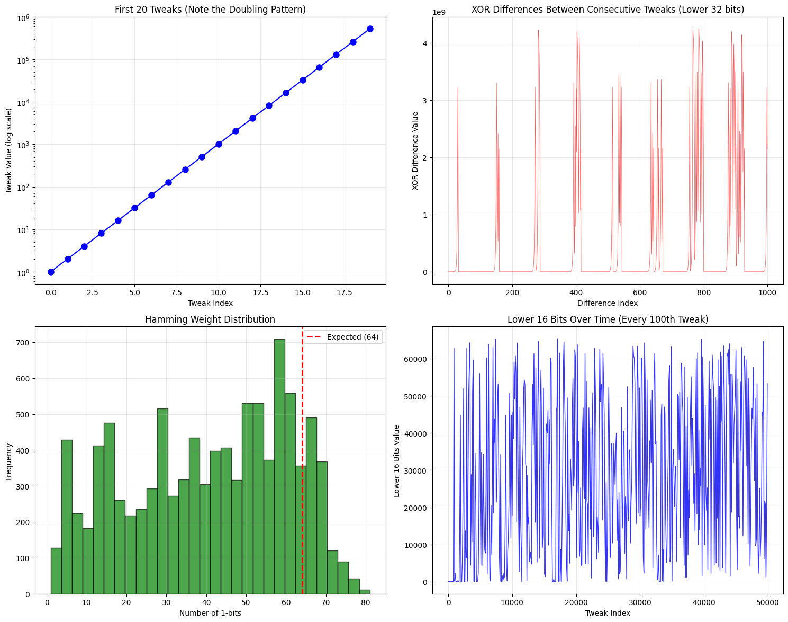

# linearity_in_aes_xts_multipliers

### Chart 1: First 20 Tweaks (Doubling Pattern)

What you'll see: A perfect exponential curve - each point is exactly double the previous one.
The linearity: This is the core problem! Each tweak is mathematically predictable from the previous one.

Chart 1 — First 20 Tweaks (Doubling Pattern)

What the chart shows:

We plotted the numeric value of the first 20 tweaks (as decimal integers).
What to look for:

If you look at tweaks in the field sense, each new tweak is the previous tweak multiplied by x (i.e. doubled). So the operation is deterministic and linear in GF(2¹²⁸).
Why it might not look like a perfect plain numeric exponential:

Because of the reduction XOR (the 0x87) that gets applied when the MSB is 1, the decimal values will sometimes drop or jump instead of showing a clean decimal doubling. But the underlying algebraic relation is still “next = 2 × previous (in GF(2¹²⁸))”.

What that means in practical terms: If an attacker learns one tweak value, they can compute the next tweak (and the next, and the next) using the same simple rule — this is the core predictability.

### Chart 2: XOR Differences Between Consecutive Tweaks

What you'll see: Structured patterns, not random noise.
The problem: In truly random data, these differences would be chaotic. The patterns show mathematical relationships.

What the chart shows: We computed tweak_i XOR tweak_{i-1} for consecutive tweaks and plotted those differences.

Why this reveals non-randomness: For truly random 128-bit values those XOR differences would look like random noise (no structure). Here you will see structured, non-chaotic values because the relationship between consecutive tweaks is simple (multiply-by-x).

What this implies: The difference values themselves reveal a mathematical relationship (not independent random values). That’s another way to see the tweak chain’s linearity.

### Chart 3: Hamming Weight Distribution

What you'll see: The distribution might be skewed from the expected center at 64.
The linearity: Random 128-bit numbers should have about 64 ones. Deviations show the sequence isn't truly random.

What the chart shows: For many tweaks we counted the number of 1-bits (the Hamming weight, between 0 and 128) and drew a histogram.

What to expect for true randomness: For 128-bit truly random words you’d expect the distribution to be approximately binomial with mean ≈ 64, roughly symmetric.

What we actually see:

The histogram can be clustered or skewed depending on the starting tweak and the small sample size. Because each tweak is derived by a linear field operation (not independent random draws), the distribution can deviate or show patterns compared to i.i.d. random values.
Why this matters:

It shows the sequence is constrained by deterministic linear algebra — not independent randomness.

### Chart 4: Lower 16 Bits Over Time

What you'll see: Repeating cycles and patterns.
The critical issue: These patterns repeat! An attacker can predict future values.

What the chart shows: We plotted the lower 16 bits of each tweak vs. index.

What you’ll see: The lower-16-bit line often cycles or shows repeating shapes.

Why that happens:

There are only 2¹⁶ possible values for those bits. Because the tweaks are generated deterministically from a linear recurrence, the lower 16 bits will follow a predictable sequence and often enter short repetitive patterns much earlier than the full 128-bit state would cycle.
What this implies:

An attacker who focuses on a small portion of the tweak (e.g., low bits) can spot and exploit repetition much sooner than waiting for full 2¹²⁸ cycles.

## The Key Revelation:
The perfect linearity is now visible because:

Each tweak = previous tweak × 2 (in GF(2^128))
This creates a completely deterministic sequence
The "randomness" is an illusion - it's actually pure math

Each step is linear: tweak_{i+1} = α × tweak_i in GF(2¹²⁸) where α = x. That means the whole chain is generated by repeated linear operations (multiplying by x repeatedly).

Linearity = predictability: learning one tweak lets you compute subsequent tweaks deterministically.

Finite field cycles: although the field has 2¹²⁸ possible values, sub-patterns (e.g., low bits) can repeat much sooner; and any linear structure is exploitable with clever algebraic attacks.

Hence the XTS rule: the XTS spec limits how many blocks you should use a single tweak sequence for (practical limit often quoted ~1 million blocks) because over many operations these linear relationships can be leveraged by attackers for distinguishing or more advanced attacks. The safe pattern is: don’t reuse tweak chains beyond recommended limits; prefer unique stored tweaks or randomized per-block tweaks when appropriate.

### Why This Matters for XTS:

1. Predictability: If an attacker learns 1 tweak, they can compute all future tweaks
2. Cycles: The sequence will eventually repeat (after 2^128 steps, but patterns emerge much sooner)
3. Exploitation: Cryptanalysts can use these linear relationships to attack the encryption

The XTS specification limits operations to ~1 million blocks precisely because this mathematical linearity becomes exploitable at scale, even though the individual operations look "random" to casual observation.

## Practical takeaways / mitigation (simple)

Don’t rely on “tweak looks random” — it’s not random, it’s linear. Treat it as a deterministic chain.

Avoid long chains: don’t reuse a single tweak chain across millions of blocks — follow XTS limits.

Store unique tweaks (or allocate unique sector numbers) when you need per-record uniqueness and non-predictability.

Authenticate the ciphertext and tweak metadata (HMAC) so tampering is detectable.

If you need unpredictability, use a secure random per-block tweak (and store it) or a keyed KDF that produces per-block non-linear values and is not reused.

### One-line demonstration of the exploitability idea

If you know a tweak T0, you can compute T1 = gf_mul_by_x(T0), T2 = gf_mul_by_x(T1), …
This is cheap and deterministic. That chain means ciphertext patterns in XTS are related across blocks in mathematically tractable ways.

## Caveats on Tweaks

There are 2 separate properties you might want from a tweak and they’re often conflated:

- Uniqueness — tweak must not collide for different records encrypted under the same XTS key.

- Unpredictability — an attacker who observes one (or many) tweak values should not be able to predict other tweaks.

Which one needed depends on the threat model.

## Summary

If you derive the tweak as HMAC(secret_key, canonical_json) then:

	- Unique (probabilistic): yes (very high probability for 128-bit truncation).

	- Unpredictable: yes, unless the attacker learns the HMAC key.

If you use the sector/address (public counter) as the tweak:

	- Unique: yes (if allocator is correct).

	- Unpredictable: no — predictable by design.

If you require both determinism (same JSON → same tweak) and unpredictability to outsiders: use a keyed PRF (HMAC or AES-PRF) with a KMS-held secret key.

If you require absolute non-predictability even if some JSON+tweak pairs are leaked, use a random per-record tweak (store it with ciphertext).

## Threat models and implications

1. Attacker can observe tweaks & ciphertexts, but does not have keys

- A keyed HMAC-derived tweak is safe: observing tweak = HMAC_k(JSON)[:16] does not let the attacker compute HMACs for other JSONs without k.

2. Attacker can choose plaintext/JSONs (chosen-input) but doesn't know the key

- Still safe: HMAC is a secure PRF. They can try different JSONs but cannot predict the keyed output beyond brute force.

3. Attacker obtains one plaintext-tweak pair and the tweak value, and wants to predict tweaks for new JSONs

- If tweak = public address or counter → attacker can predict future tweaks (bad).

- If tweak = HMAC_k(JSON) and k is secret → single observed pair doesn't let them predict others.

4. Key compromise (attacker learns KMS secret)

- Everything that was keyed becomes predictable and decryptable → you must rotate keys and re-encrypt.

“if an attacker learns 1 tweak, they can compute all future tweaks” is only true if your tweak-derivation is predictable (e.g., an address/counter) or if the secret is compromised.

# xts_tweak_derive.py

## Caveats

Never reuse a tweak-key pair for different plaintexts under XTS. Reuse can break confidentiality. If you need to re-encrypt a record, allocate a new tweak or rotate keys.

XTS is not authenticated — always store an authentication tag (HMAC) that covers JSON and ciphertext and verify on decrypt.

Keep keys separate: use different keys for XTS (512-bit) and HMAC (256-bit).

Key compromise mitigation: rotate keys; implement revocation/expiry and re-encryption if possible.

Audit & logging: record allocations if you use a mapping approach so you don’t accidentally reassign tweaks.

HMAC has truncation (32 bytes truncate to 16 bytes). Tweak length = 16 bytes. 

